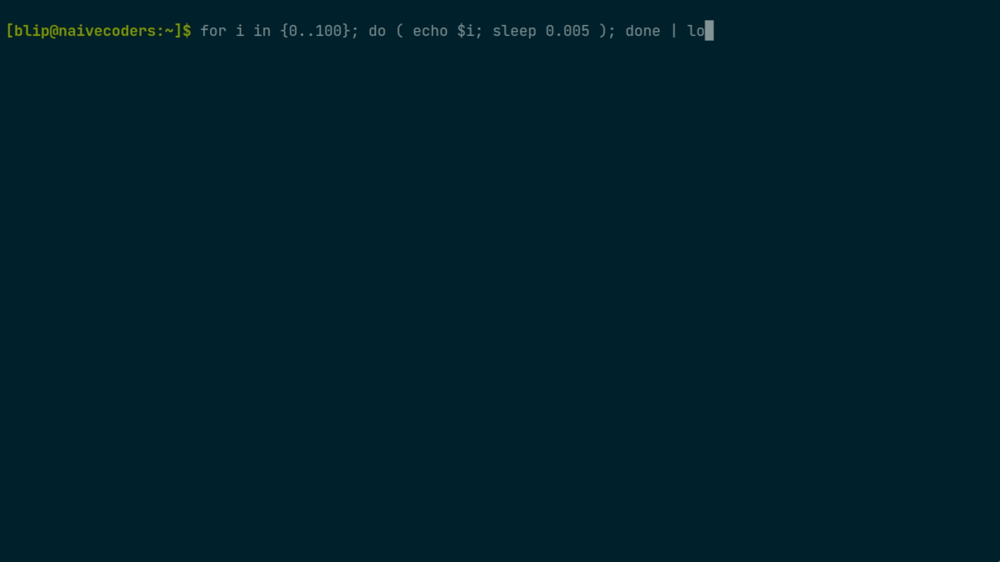

Loadbar: a shell progress bar
=============================

Loadbar is a POSIX shell script that display a progress bar on your terminal.
It reads values from stdin and compute a percentage (assuming max value is 100 if no option passed, see below).

It can also be sourced by another script, where you should call `loadbar_init()` for initialization and `loadbar_display_bar_once()` to update the progress bar for each value.
The progress bar can be reconfigured by calling `loadbar_init()` again with the new settings.

It support these different options:

 - `-t [VALUE]`, `--title [VALUE]`: print a label before the progress bar
 - `-m [VALUE]`, `--max [VALUE}`: define the maximum value to read to consider the progress 100%
 - `-p`, `--percentage`: display the percentage of the progression
 - `-v`, `--value`: display the value of the progression
 - `-f [CHAR]`, `--fill [CHAR]`: pick a different character to use for the fill part of the progress bar
 - `-b [CHAR]`, `--background [CHAR]`: pick a different character to use for the background part of the progress bar
 - `-n`, `--no-color`: do not use any color for the display bar
 - `-s`, `--size`: define the size (text included) of the bar. Take full length if not defined.
 - `-h`, `--help`: display help



The examples folder provide two sample scripts for running loadbar via stdin or via script. The examples should be run from the root folder, for example:

```console
    $ ./examples/stdin_example.sh
    $ ./examples/script_example.sh
```
